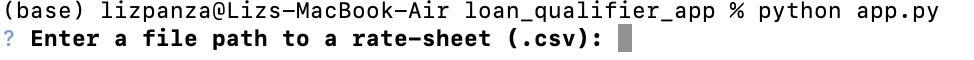

# Loan Qualifier App

Developing an app to save the qualifying loans to a CSV file so that can be shared the results as a spreadsheet.

---

## Technologies

This project was developed with python 3.7 with the following packages:

* [fire](https://github.com/google/python-fire) - For the command line interface, help page, and entry-point.

* [questionary](https://github.com/tmbo/questionary) - For interactive user prompts and dialogs


---

## Installation Guide

Before running the application it is necessary to install the following dependencies.

```python
  pip install fire
  pip install questionary
```
---

## Usage


To use the application simply clone the repository and run the **app.py** :

```python
python app.py 
```

Upon launching the qualifying loan will be greeted with the following prompts.



---

## Contributors

This was a project developed as a group during a Fintech Bootcamp. 

---

## License

MIT
